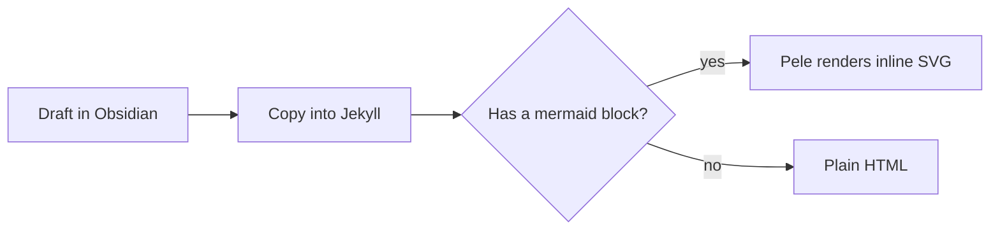
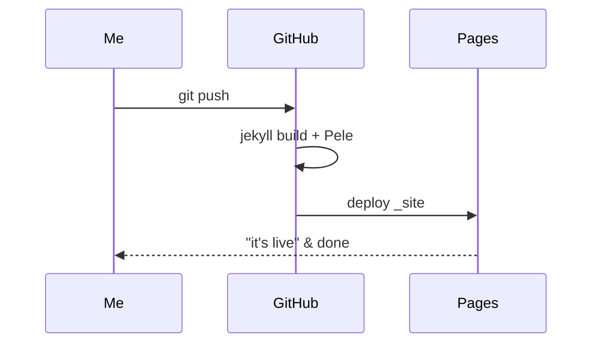
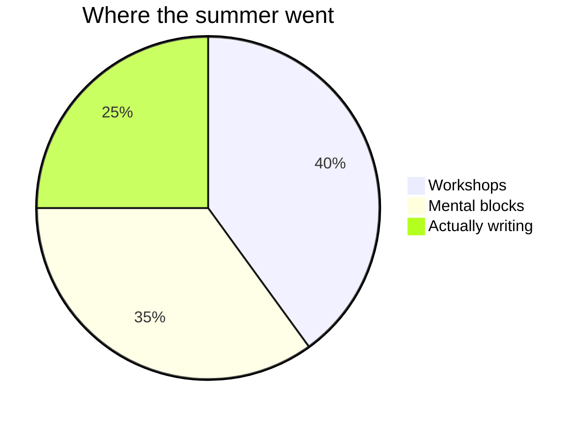

A flowchart:

```mermaid
flowchart LR
  A[Draft in Obsidian] --> B[Copy into Jekyll]
  B --> C{Has a mermaid block?}
  C -->|yes| D[Pele renders inline SVG]
  C -->|no| E[Plain HTML]
```

A sequence diagram:

```mermaid
sequenceDiagram
  participant Me
  participant GitHub
  participant Pages
  Me->>GitHub: git push
  GitHub->>GitHub: jekyll build + Pele
  GitHub->>Pages: deploy _site
  Pages-->>Me: "it's live" & done
```

A pie chart:

```mermaid
pie title Where the summer went
  "Workshops" : 40
  "Mental blocks" : 35
  "Actually writing" : 25
```
